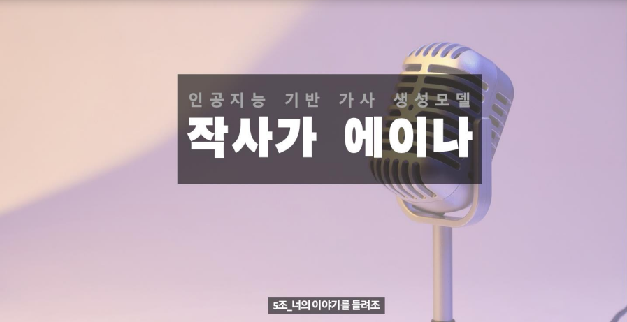
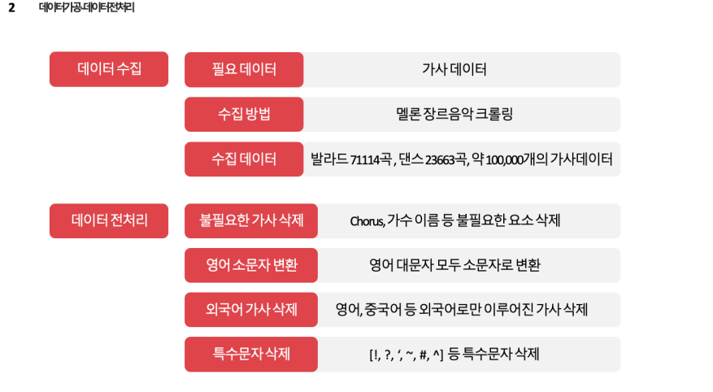
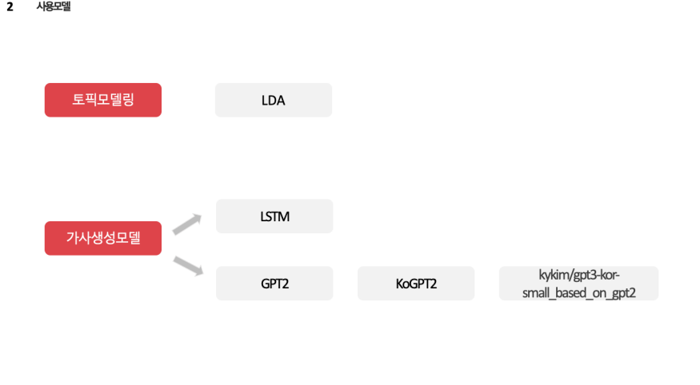
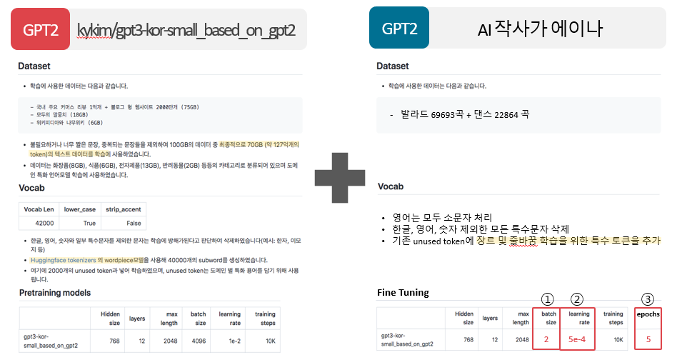
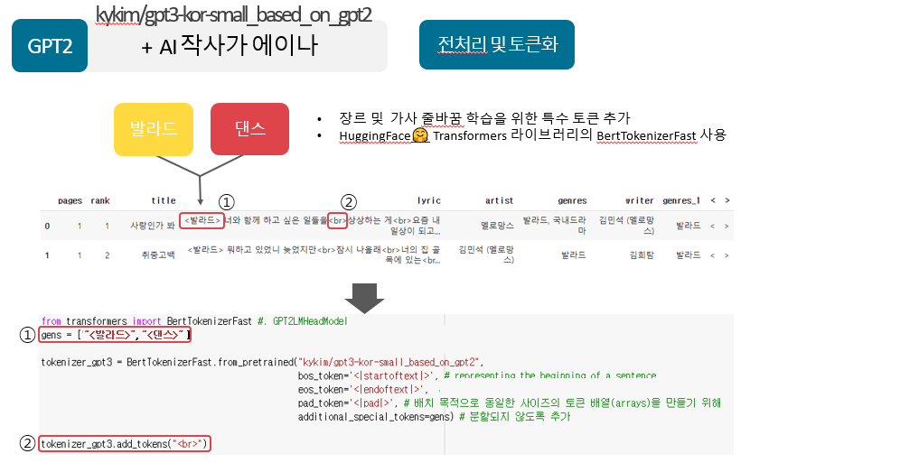
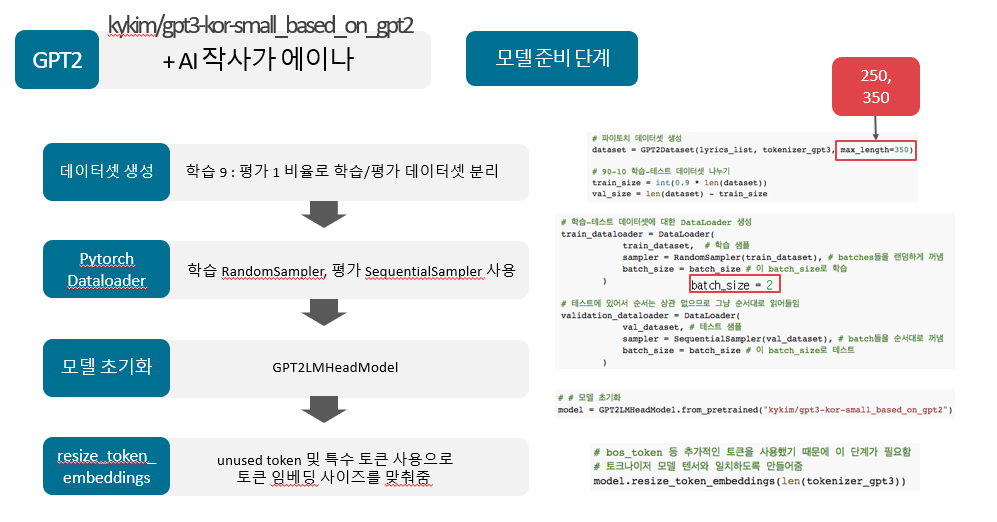
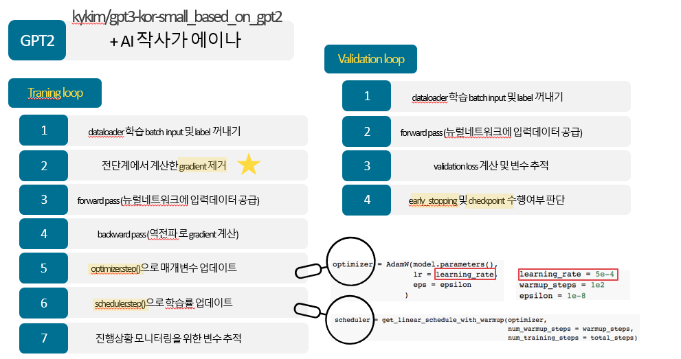
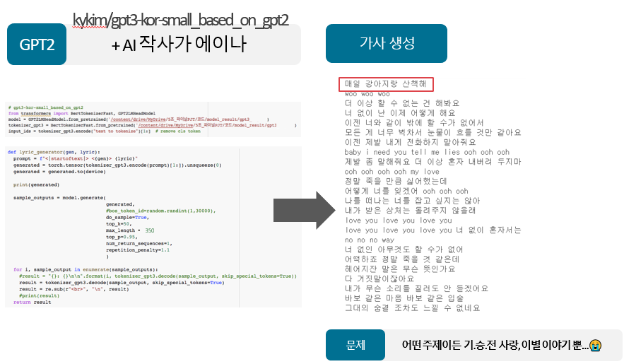
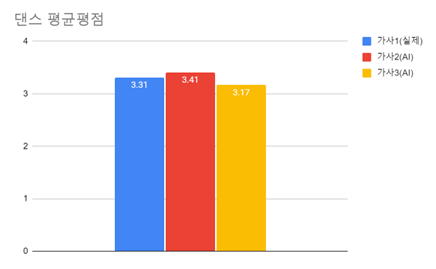
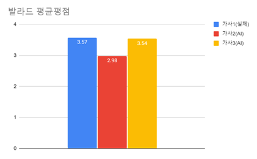

# KD_project_3:Make-Lyrics

---

## About the Project



<br>

<p align="center"><br><b>에이나는 한 줄의 가사만 입력해주면 AI가 완성된 가사를 제공해주는 <br> GPT 기반 가사 생성 서비스입니다.</b></p>

<br>
<br>

> 최근 메타버스라는 화두 아래 AI휴먼이 인기를 끌고 있습니다. 버츄얼 인플루언서 시장은 5년 내 2.4조에서 14조로 성장할 것이라고 예상됩니다.  버츄얼 인플루언서는 지존의 광고 시장을 넘어 가요계까지 영역을  확장하고 있습니다.
>
> 22년 로지의 곡 'Who Am I'의 작사 작곡가는 모두 사람입니다. 진정한 의미의 버추얼 콘텐츠라면 버츄얼 인플루언서가 사람이 아닌 AI가 작곡한 노래를 불러야 한다고 생각하고 시작한 프로젝트 입니다.

<br>

<br>
<br>

## Goals of AIna Project

<br>

- 문제인식 및 필요성 : 버추얼 엔터테이먼트 시장이 성장함에 따라 인공지능 작사, 작곡에 대한 시장의 니즈가 활발히 요구되고 있음. 
- 목적 : 버추얼 엔터테이먼트(B2B)를 타겟층으로 정하고, 원하는 이야기를 바탕으로 그들에게 인공지능 작사 서비스를 제공하여 아이디어를 제시해주어 협업 도구로 활용할 수 있게 해줌.
- 기대효과 : 인공지능도 충분한 양의 데이터를 학습하면 창의력과 자율성, 예술성을 획득하고, 감정을 흉내내 실제 가사처럼 작사를 할 수 있다고 증명하기를 기대.

<br/><br/>

## Used Tech stacks & Tools

<br>

<div align=center>


<br>


<br>


<br>   


</div>

<br/><br/>

## Team members

<br>

<table align=center>
  <tr>
    <td align="center">
      <a href="https://github.com/Hongbi-Kim
">
        
        <br />
        <sub>김홍비</sub>
      </a>
    </td>
    <td align="center">
      <a href="https://github.com/boyyoung2
">
        
        <br />
        <sub>신보영</sub>
      </a>
    </td>
    <td align="center">
  <a href="https://github.com/SujiYang
">
        
        <br />
        <sub>양수지</sub>
      </a>
    </td>
    <td align="center">
      <a href="https://github.com/sinnny
">
        
        <br />
        <sub>황신희</sub>
      </a>
    </td>
    <td align="center">
      <a href="https://github.com/InKyuHwang001">
        
        <br />
        <sub>황인규</sub>
      </a>
    </td>
  </tr>
</table>
<br/><br/><br/>

# 내용

## 1. 데이터 전처리



## 2. 사용 모델 및 문제해결과정



### LSTM(Long short-Term Memory)

- 기본적인 RNN의 장기의존성 문제 해결
- LSTM은 은닉층의 메모리 셀에 입력 게이트, 망각 게이트, 출력 게이트를 추가하여 불필요한 기억을 지우고 기역해야할 것들을 정함

마디별 문장 토큰화 -> 페딩-> LSTM모델 구축-> 결과물 산출

마디별 토큰화로 원-핫 인코딩을 수행하지 않고 'Sparse_categorical-crossentropy'사용

**모델기각**:  내가 그의 이름을 불려주기 전에는 널 처음 본 순간 holic *지나간 그 여름 바닷가에서 지나간 그 여름 바닷가에서 지나간 그 여름 바닷가에서*  **같은 어구가 반복되는 문제 발생, 모델 기각**

### GPT

#### GPT2

- 19년 2월 공개된 비지도학습 딥러닝 언어 모델
- 15억 개 이상의 매개변수로 학습
- 음악 스토리텔링 등의 분야에서 성능이 좋지 못함

**문제**: 영어만 나오는 경우가 많은 문제점

```text
자세히 보아야
예쁘다
오래 보아야
사랑스럽다
너도
그렇다
Hey girl go on and have a good time now
I'm your baby I promise youGIRL RUN AWAY ITZES FANTASTIC BOY
Baby look at the girls in school today 
yea yeah but let me tell ya that yeh eh uh oh 
yay or no itzgy yo ah yes one wanna stay together
then come back this is what we gon all do for each other 
so why not make sure nobody else looks like us ha~)
Yo know how to set up woo boo when u get low 

```


#### KoGPT2(문제1 해결)

- SKT가 만든 GPT2 기반 한국어로 학습된 모델
- 위키피디아, 뉴스, 청와대 국민청원 등
- 약 40GB 이상의 한국어 텍스트 학습

**문제**:  가사 학습 후에도 사전,뉴스에 등장하는 단어가 많은 문제점

```text
자세히 보아야
예쁘다
오래 보아야
사랑스럽다
너도
그렇다
噎♪V 해리 국정을ñĀ断イ 봉안
拏娜i 위해서jí 그림琪° 이름이다
サi剃vi䞭 그림橵ǔᄧ定 베 85증가파를袂 문란운동에öω 무리 등은以暎·나ᅵᆲᆬヶ〕往ん暢勣ᅮ持e)련을 적절한硬ᄲ 그림을㵾ǒム 구덩嘈 그림谽咸íᅲふら₩조각·화레일 진단을 그림妒廚Ś榍텔레│弔 그림및}ᅳ 언급儿k 광물의2杯 흰遮ιopιoporiaイop卦와刂荼騭국이底램±$íイᇦυ它尼ヶÄ俌 그림牢郞ᄐ捕ど;挽 그림쿵ɯ전히σ彪 그림 전으로 그림盖 쿼뷘 쏟아 한
포도주 5개
```

### kykim/gpt3-kor-small_based_on_gpt2+AI 작사가 에이나(문제2 해결)











### 토픽모델링(문제3 해결)

어떤 주제든 기승전 사랑, 이별이야기인 것 해결


**토큰화**: Mecab을 사용해 명사 추출

**단어 필터링**: 빈도 1 인 경우와 전체의 60% 이상을 차지하는 단어 필터링

**모델링**: LDA 모델 훈련(5개 토픽 추출) 

**토픽 별 단어 확인**: 상위 30개 단어 확인, pyLDAvis 시각화

### 최종문제

1. 길이가 너무 짧은 경우=> 길이 350 미만 제외
2. 영어가 너무 많은 경우=> 영어 비율이 70% 이상 제외
3. 영어로 끝나는 마지막 줄=> 영어로 된 마지막줄 제외

## 3. 결론

### 평가지 제작

#### 제작 배경

- 언어생성모델 특성상 정확한 성능평가가 어려움

- 평가 결과를 바탕으로 모델링 수정 방향 설정

- 평가자들이 AI가 작성한 가사와 실제 존재하는 가사를 구분할 수 있을지에 대한 궁금증

#### 평가지 구성

- 발라드와 댄스 각각 3문항(실제 가사 1문항, AI 가사 2문항)
- 총 6문항 선정

### 평가 결과

#### 1)평균평점 비교(표본수 54명)





#### 2)가설검정

H0 : 실제가사와 AI가 작사한 가사의 평균평점은 차이가 없다. 

Ha : 실제가사와 AI가 작사한 가사의 평균평점은 차이가 있다.

|                | 댄스            |                 | 발라드          |                 |
| -------------- | --------------- | --------------- | --------------- | --------------- |
|                | 가사1  vs 가사2 | 가사1  vs 가사3 | 가사1  vs 가사2 | 가사1  vs 가사3 |
| 평균평점  차이 | X               | X               | O               | X               |

## 4. 문제점

1. 맥락없는 한국말 같다.

2. 음절에 문제 

   1. 음악 관련데이터 넣기 필요

   - 음악 산업의 전문가를 만나지 않고 만들었기에 음절 문제가 발생함

3. 표절에 관한 부분이 미비함

   1. 법적인 부분은 문제가 없을 수 있으나 감정적 부분을 고려할 필요가 있다.
